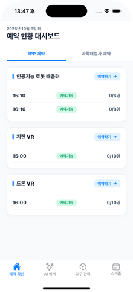
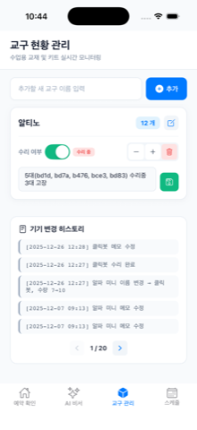
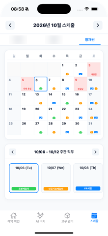

# ipp-reservation-app (CNSE Works)

충남교육청 과학교육원 현장 운영진을 위한 Expo/React Native 앱입니다. 프로그램 예약 현황 확인, AI 예약 비서 챗봇, 교구 재고 관리, 근무자 구역 로테이션 스케줄 기능을 제공합니다.

예약 데이터와 AI 챗봇은 [`ipp-reservation-server`](https://github.com/wodnjs2020136144/ipp-reservation-server) 백엔드에서 제공됩니다.

## 스크린샷

| 예약 확인 | AI 비서 | 교구 관리 | 스케줄 |
|---|---|---|---|
|  |  |  |  |

## 기술 스택

- **프레임워크**: Expo SDK 53 / React Native 0.79.5 / React 19 (prebuild 상태, `ios/`·`android/` 포함)
- **내비게이션**: React Navigation (bottom-tabs + native-stack)
- **백엔드**: `ipp-reservation-server` REST API + Firebase (Firestore, 익명 Auth)
- **로컬 저장소**: AsyncStorage

## 폴더 구조

```
App.js                 진입점 — Firebase 익명 로그인 게이트, 탭 내비게이션
firebase.js            Firebase 앱/Firestore/Auth 초기화
firestore.rules        Firestore 보안 규칙
screens/               HomeScreen(예약 확인), AiChatScreen, KitsScreen, ScheduleScreen
components/            ReservationItem, LoadingView
constants/theme.js     공용 색상 팔레트
services/              api.js(예약 서버 클라이언트), kitService.js, scheduleService.js, dummyData.js
```

## 주요 화면

| 탭 | 설명 |
|---|---|
| 예약 확인 | IPP / 과학해설사 그룹별 오늘 예약 현황, 1분 자동 새로고침, cnse.or.kr 예약 페이지 링크 |
| AI 비서 | 서버의 Gemini 챗봇에 예약 현황을 자연어로 질의 |
| 교구 관리 | 교구 수량 증감, 수리중 토글, 메모, 변경 이력 — Firestore 실시간 반영 |
| 스케줄 | 근무자 3명의 구역(인공지능배움터/VR체험/로봇배움터) 평일 기준 자동 로테이션, 공휴일·월차 반영, 수동 조정 |

## 시작하기

```bash
npm install
cp .env.example .env   # 선택 — 비워두면 운영 서버/Firebase 기본값 사용
npx expo start
```

| 변수명 | 설명 |
|---|---|
| `EXPO_PUBLIC_API_BASE_URL` | 예약 서버 주소 (기본값 `https://ipp-reservation-server.fly.dev`) |
| `EXPO_PUBLIC_FIREBASE_*` | 다른 Firebase 프로젝트(개발/스테이징 등)로 연결할 때만 설정 |

- 네이티브 빌드: `npm run ios` / `npm run android`
- Xcode 26에서는 RCT-Folly의 `fmt` 컴파일 에러로 iOS 네이티브 빌드가 실패합니다(`ios/Podfile` 주석 참고). 이 경우 `npx expo start --go`로 Expo Go에서 확인하세요.
- 스케줄 화면의 공휴일 데이터(`HOLIDAYS`)는 2026년까지 들어 있어 매년 갱신이 필요합니다.

## Firebase

Firestore의 `kits` 컬렉션(교구), `logs/kitLogs`(교구 변경 이력), `settings/scheduleConfig`(스케줄 설정)를 사용합니다. 익명 로그인 사용자만 읽고 쓸 수 있으며, 규칙은 `firestore.rules`에 있습니다.
